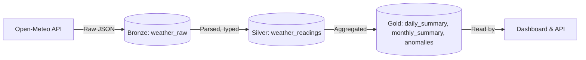

# Kenya Weather Data Warehouse

[](https://www.python.org/)
[](https://www.postgresql.org/)
[](https://airflow.apache.org/)
[](https://dash.plotly.com/)
[](https://www.docker.com/)
[](https://opensource.org/licenses/MIT)

**Production-ready data warehouse pipeline for weather monitoring across 5 Kenyan cities.**  
Built with a **medallion architecture** (Bronze → Silver → Gold), automated with **Apache Airflow**, stored in **PostgreSQL**, and served via a **Plotly Dash** dashboard and **Flask REST API**.

---

## Features

- **5 Kenyan cities**: Nairobi, Mombasa, Kisumu, Nakuru, Eldoret  
- **Real‑time data** from the free [Open‑Meteo API](https://open-meteo.com/) (no API key needed)  
- ** Medallion Architecture** (Bronze/Silver/Gold) for data quality and reprocessing  
- **Automated hourly ingestion** with Airflow – set and forget  
- **Interactive Dashboard** in pure Python (Plotly Dash) – no Grafana required  
- **REST API** (Flask) for downstream applications  
- **Transformations**: daily aggregates, monthly rollups, anomaly detection (2σ)  
- **Optional weekly email repo Architecture

### Medallion Layers



**Bronze** – exact API response, never modified (audit trail)  
**Silver** – clean hourly readings with typed columns, deduplicated  
**Gold** – business‑ready aggregations (daily, monthly) and anomaly flags  

Full pipeline: **Generation → Storage → Ingestion → Transformation → Serving**

---

## Tech Stack

| Layer            | Technology                                      |
|------------------|-------------------------------------------------|
| **Collection**   | Python, `openmeteo-requests`, `pandas`          |
| **Storage**      | PostgreSQL 15 (schemas: `bronze`, `silver`, `gold`) |
| **Orchestration**| Apache Airflow 2.8 (Docker)                     |
| **Dashboard**    | Plotly Dash 2.17                                |
| **API**          | Flask 3.0                                       |
| **Infrastructure**| Docker Compose                                  |
| **Monitoring**   | Airflow DAGs, logging, email alerts             |

---

## Project Structure

```
weather-data-warehouse/
├── .env.example              # Template for secrets
├── requirements.txt          # Python dependencies
├── docker-compose.yml        # PostgreSQL + Airflow
├── scripts/
│   ├── init_db.sql           # Schema & tables (auto-run at first start)
│   └── setup_airflow.sh      # Airflow connection setup
├── src/
│   └── db/
│       └── connection.py     # DB engine singleton
├── generation/
│   └── weather_ingest.py     # Stage 1 – API → Bronze + Silver
├── transformation/
│   ├── transform_runner.py   # Stage 4 – SQL execution
│   ├── daily_summary.sql
│   ├── monthly_summary.sql
│   └── anomaly_detection.sql
├── dags/                     # Stage 3 – Airflow DAGs
│   ├── hourly_ingest.py
│   ├── backfill.py
│   ├── daily_transforms.py
│   └── weekly_digest.py
├── serving/                  # Stage 5
│   ├── dashboard.py          # Dash on port 8050
│   ├── api.py                # Flask on port 5000
│   └── reports.py            # Weekly HTML email generator
└── logs/                     # Airflow logs
```

---

## Getting Started

### Prerequisites

- **Python 3.11** and `pip`
- **Docker Desktop** (or Docker Engine + Compose)
- **Git**

### 1. Clone & Configure

```bash
git clone https://github.com/yourhandle/weather-data-warehouse.git
cd weather-data-warehouse

cp .env.example .env
# Edit .env with your passwords (see inline comments)
```

Generate Airflow Fernet and secret keys:

```bash
python -c "from cryptography.fernet import Fernet; print(Fernet.generate_key().decode())"   # → AIRFLOW_FERNET_KEY
python -c "import secrets; print(secrets.token_hex(32))"                                   # → AIRFLOW_SECRET_KEY
```

### 2. Start the Stack

```bash
docker compose up -d
```

Wait ~60 seconds for all services to be healthy:
- PostgreSQL → `localhost:5432`
- Airflow Web UI → [http://localhost:8080](http://localhost:8080) (login: `admin` / your `AIRFLOW_ADMIN_PASSWORD`)
- The database schema is created automatically via `init_db.sql`.

### 3. Install Python Dependencies

```bash
python -m venv .venv
source .venv/bin/activate   # Windows: .venv\Scripts\activate
pip install -r requirements.txt
```

### 4. Configure Airflow Connections

```bash
bash scripts/setup_airflow.sh
```

This registers the `weather_postgres` connection inside Airflow.

---

## Running the Pipeline

### Manual Ingestion (one‑time)

```bash
# Dry run – shows sample data without writing to DB
python generation/weather_ingest.py --dry-run

# Load 31 days of history into Bronze & Silver
python generation/weather_ingest.py --mode backfill
```

### Transformations (Silver → Gold)

```bash
python -m transformation.transform_runner --transform all
```

This computes:
- `gold.daily_summary` (per city, per day)
- `gold.monthly_summary` (per city, per month)
- `gold.temperature_anomalies` (last 25 hours)

### Enable Airflow Scheduling

Go to [Airflow UI](http://localhost:8080) and toggle the **ON** switch for:

| DAG                        | Schedule                   | Description                        |
|----------------------------|----------------------------|------------------------------------|
| `hourly_weather_ingest`    | `0 * * * *` (every hour)   | Fetches latest hourly data         |
| `daily_weather_transforms` | `0 22 * * *` (01:00 EAT)   | Runs daily + anomaly transforms    |
| `backfill_weather`         | Manual trigger only        | Loads 31 days of history on demand |
| `weekly_weather_digest`    | `0 4 * * 1` (07:00 Monday) | Sends weekly HTML email report     |

---

## Dashboard & API

### Dashboard

```bash
python serving/dashboard.py
```

Open [http://localhost:8050](http://localhost:8050) for an interactive dashboard with:

- **Overview** – Yesterday’s conditions for each city
- **Temperature** – 30‑day trend & min‑max‑avg range
- **Rainfall** – Daily bars & 7‑day rolling average
- **Anomalies** – Flagged readings with 2σ deviation
- **Monthly** – Aggregated per month

### REST API

```bash
python serving/api.py
```

| Endpoint                                  | Description                               |
|-------------------------------------------|-------------------------------------------|
| `GET /health`                             | Health check                              |
| `GET /api/cities`                         | List of monitored cities                  |
| `GET /api/weather/current/<city>`         | Latest daily summary                     |
| `GET /api/weather/daily/<city>?from=...&to=...` | Daily summaries in range           |
| `GET /api/weather/monthly/<city>`         | Last 12 monthly summaries                 |
| `GET /api/weather/anomalies?city=...&hours=48` | Recent temperature anomalies         |
| `GET /api/weather/compare?date=YYYY-MM-DD` | All cities for a specific date          |
| `GET /api/export/csv?city=...&from=...&to=...` | Download data as CSV                |

Example: `curl http://localhost:5000/api/weather/current/Nairobi`

---

## Weekly Email Reports (Optional)

Fill in the SMTP settings in `.env`. Then:

- Test report generation: `python serving/reports.py`
- Enable the `weekly_weather_digest` DAG in Airflow.

---

## Extending the Project

- **Add a new city** – simply append an entry to the `CITIES` list in `generation/weather_ingest.py`.  
- **Add a new weather variable** – add it to `HOURLY_VARS`, update `init_db.sql` schema, and add the column in `parse_response()`.  
- **New dashboard panel** – add a Dash `Tab` and a callback that queries `gold` tables.  
- **New API endpoint** – add a route in `api.py` using the `db_query` helper.

---

## Common Issues

| Symptom                                     | Fix |
|---------------------------------------------|-----|
| `DATABASE_URL is not set`                   | Make sure `.env` exists and is sourced, or export the variable. |
| `could not connect to server`               | PostgreSQL not running – `docker compose up -d postgres` |
| `relation … does not exist`                 | Run `docker compose exec postgres psql … -f /docker-entrypoint-initdb.d/init_db.sql` |
| Airflow DAGs not visible                    | Restart scheduler: `docker compose restart airflow-scheduler` |
| `No module named 'openmeteo_requests'`      | Activate your virtual environment and run `pip install -r requirements.txt` |
| Dashboard shows “No data yet”               | First run ingestion + transforms: `python generation/weather_ingest.py --mode backfill` then `python -m transformation.transform_runner --transform all` |

---

## Learning Path

This project demonstrates:

- **Beginner** – Python scripting, APIs, Docker, PostgreSQL basics  
- **Intermediate** – Airflow DAGs, SQL aggregations, window functions, upserts, timezone handling  
- **Advanced** – Medallion architecture, anomaly detection, Plotly Dash, Flask REST API design, pipeline observability  

After mastering this, consider exploring **dbt**, **Great Expectations**, **Kafka**, **FastAPI**, and **Kubernetes**.

---

## Contributing

Pull requests are welcome! For major changes, please open an issue first to discuss what you would like to change. This project follows the conventional commit style.

---

## License

This project is licensed under the MIT License – see the `LICENSE` file for details.

---

## Acknowledgments

- Weather data by [Open-Meteo](https://open-meteo.com/) (free, no API key required)  
- Built with love in Nairobi 🇰🇪  

---

> **Ready to run?** `docker compose up -d` and you're on your way to a professional weather data warehouse.